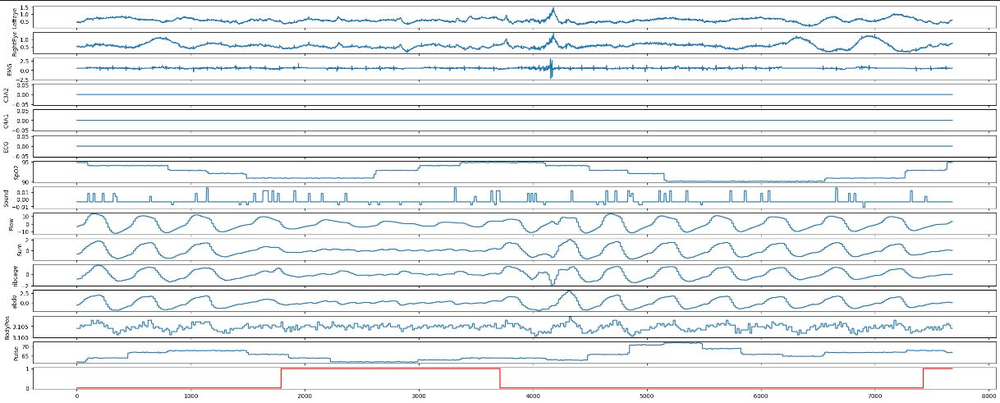

# Sleep apnea segmentation


## Overview

This repository trains a neural network to segment sleep apnea from physiological signals. Several signals are recorded during sleep at night. The goal is to detect if 
at each time of the siganls, there exists a respiratory-event (sleep apnea) or no-event (normal). Below is an example.  The first 14 graphs correspond to polysomnographic recorded signals. The last graph corresponds to the labels at each instant. 


Since the task here is a sequence to sequence classification, I used the Unet 1D network (https://arxiv.org/pdf/1505.04597). But we could also use recurrent neural networks such as LSTM.
). 

## Installation


Clone this repository:

```sh
$ git clone https://github.com/Abdoulaye-Koroko/Sleep-apnea-segmentation-keras.git
$ cd Sleep-apnea-segmentation-keras

```

Then, create a new virtual environment and install all the required packages:

```sh
$ pip install -e .
$ pip install -r requirements.txt
```

Finally download the dataset:

```sh
$ wget -r -N -c -np https://physionet.org/files/ucddb/1.0.0/
```

## Training


To train the model just run the following line command:


```sh
$ python app/train.py --optim sgd --num_epochs 200 --lr 0.0001 --batch_size 128
```
The `optim` argument can be changed to ` adam` to train the model with Adam optimizer.

## Inference

After training, the trained model is saved in the folder `model`. So to do inference, you just need to load it.


```python 
import tensorflow as tf
from app.metrics import recall_score,precision_score,f1_score

model_path = "models/model_name.h5"
with tf.device('/cpu:0'): # can be gpu
    model = tf.keras.models.load_model(model_path,custom_objects={"recall_score":recall_score,"precision_score":precision_score,"f1_score":f1_score})
    
loss,accuracy,precision,recall,f1_score = model.evaluate(X_test,y_test)
```
